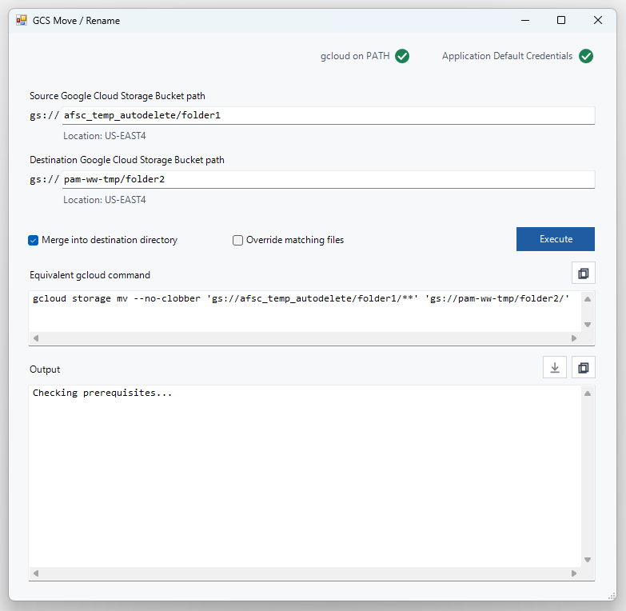
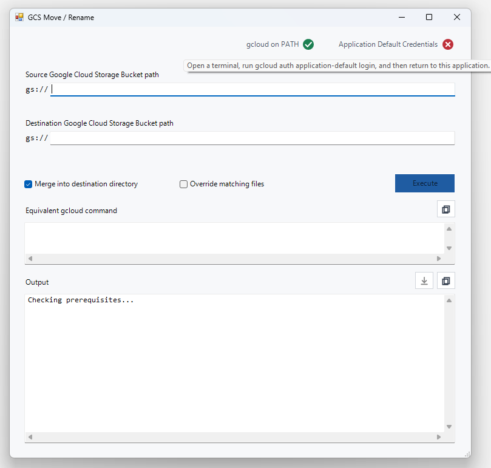

# GCS Move / Rename Tool

[](https://github.com/DanWoodrichNOAA/GCS_Move_Rename_Tool/releases/latest/download/GcsMoveTool.exe)

A small Windows PowerShell/WinForms application for moving or renaming Google Cloud Storage objects without mounting a bucket or downloading and re-uploading data. Moving / renaming data (synonymous in GCS) is a common pain point in Google Cloud Storage buckets: while working over mounts in a local client is often a convenient way to interface with buckets, an operation that feels like a simple rename can be incorrectly interpreted by mount software as a download / reupload operation, which can lead to crashes, poor performance, and high data egress charges. 

For these reasons, keeping rename / move operation strictly on the platform is both performant and cost efficient. This can be done with a google provided utility, gcloud CLI, in the most simple form shown below. 

```powershell
gcloud storage mv 'gs://source/path' 'gs://destination/path'
```

However, the gcloud CLI can be user unfriendly, and even for experienced users the syntax isn't always obvious. Trailing slashes, wildcards, and source folder duplication on conflict can turn a simple logical operation into an arduous learning exercise, and potentially put data at risk if the behavior of the utility is misinterpreted. 

This application serves to leverage the powerful server side operations for GCS in a user-friendly and consistent local interface. 



## How to use

Download the .exe for the tool from the latest release, using the link at the top of the readme. Place in a local folder of your choosing. When first opened, opt to trust the tool. 

The application will automatically check for needed dependencies, which are often already configured on systems of users that have used Google Cloud Platform before. If they are not found, hover over the ❌ and the application hover will tell you how to resolve the issue. 



## Dependencies and other Prerequisites

- [Google Cloud CLI](https://cloud.google.com/sdk/docs/install) installed and `gcloud` available on `PATH`.
- Google Cloud CLI authorized with `gcloud auth login`.
- GCS permissions needed to read/create/delete and list the affected objects, and get bucket metadata.

# Disclaimer

This repository is a scientific product and is not official communication of the National Oceanic and Atmospheric Administration, or the United States Department of Commerce. All NOAA GitHub project content is provided on an "as is" basis and the user assumes responsibility for its use. Any claims against the Department of Commerce or Department of Commerce bureaus stemming from the use of this GitHub project will be governed by all applicable Federal law. Any reference to specific commercial products, processes, or services by service mark, trademark, manufacturer, or otherwise, does not constitute or imply their endorsement, recommendation or favoring by the Department of Commerce. The Department of Commerce seal and logo, or the seal and logo of a DOC bureau, shall not be used in any manner to imply endorsement of any commercial product or activity by DOC or the United States Government.
